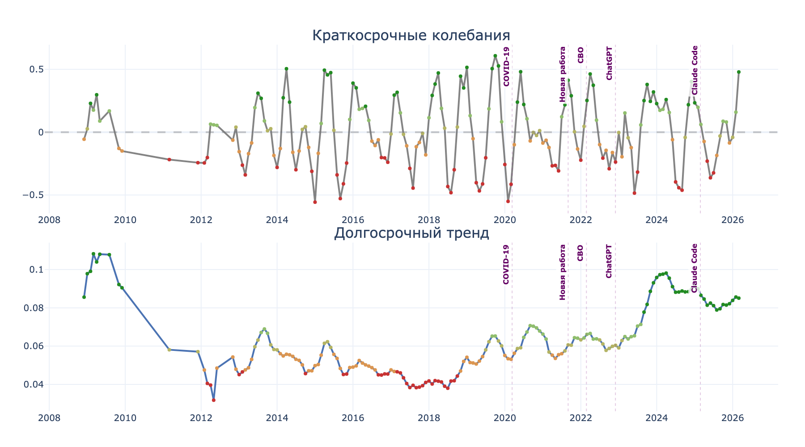
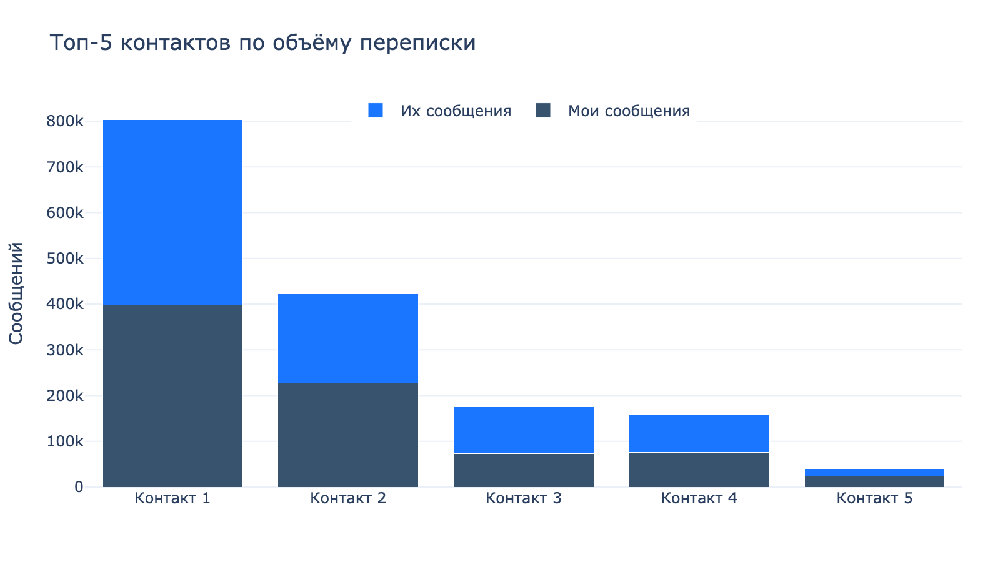
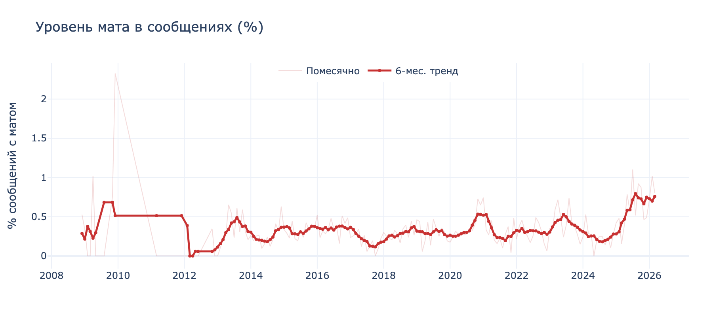
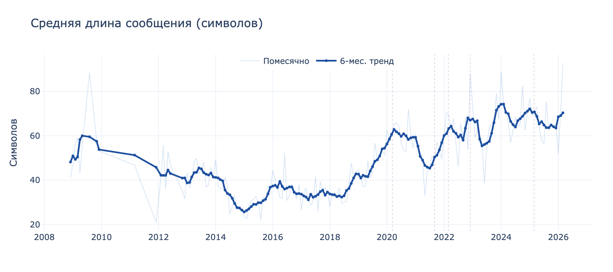

# Telegram Mood Chart

Анализ настроения и стиля общения по истории переписки за все годы. Telegram, Google Chat, ICQ/QIP и другие мессенджеры.

> **Этот проект рассчитан на работу с AI-ассистентом.** Данные из мессенджеров приходят в разных форматах, разной степени полноты, с дубликатами и пробелами. Вручную это собирать мучительно. Скажите вашему любимому AI-harness (Claude Code, Cursor, Windsurf, Aider и др.) что делать -- он разберётся.



## Примеры аналитики

### График настроения с вехами
Композитная оценка настроения по месяцам. На график наложены значимые события: начало COVID, новая работа, начало СВО, выход ChatGPT, Claude Code. Видно, как каждое событие влияло на тон переписки.

### С кем вы общаетесь больше всего

*Объём переписки по контактам. Видно соотношение: кто из вас пишет больше.*

### Как менялся уровень мата

*Частота мата коррелирует со стрессовыми периодами. Видны пики и спады.*

### Эволюция длины сообщений

*От коротких SMS-стиля к развёрнутым лонгридам. Видна эпоха мессенджеров (короткие) vs эпоха ИИ (длинные).*

## Что можно спросить у агента

Вот реальные примеры вопросов, которые можно задать:

### Настроение и события
- *"С чем связан провал настроения в марте 2022?"* -- агент найдёт ключевые слова и темы этого периода
- *"Добавь на график событие: новая работа в сентябре 2021, переезд в июне 2023"*
- *"Как повлиял приём антидепрессанта X на настроение? Добавь период с февраля по август 2024"*
- *"Покажи сезонные паттерны -- мне хуже зимой?"*

### Люди и общение
- *"С кем я общаюсь больше всего? Покажи топ-5"*
- *"Кому я пишу первым, а кто пишет мне первым?"*
- *"Какая была самая длинная непрерывная беседа в моей жизни и о чём она была?"*
- *"Как менялась интенсивность общения с топ-5 контактами по годам?"*
- *"Найди периоды, когда я писал необычно мало -- это депрессия или отпуск?"*

### Стиль и язык
- *"Как менялся уровень мата за 15 лет?"*
- *"Как менялась длина моих сообщений?"*
- *"Покажи лексическое разнообразие по месяцам"*
- *"В какое время суток я обычно пишу? Менялось ли это?"*
- *"Сравни мой стиль общения в рабочих и личных чатах"*

### Контент и интересы
- *"Какие фильмы и книги я обсуждал? Собери список"*
- *"Какие рекомендации мне давали -- что почитать, посмотреть, поиграть?"*
- *"Построй граф связей: кто с кем связан через общие темы"*
- *"Найди все упоминания поездок и путешествий"*

## Быстрый старт

### 1. Экспортируйте данные из Telegram

1. Откройте **Telegram Desktop** (не мобильное приложение)
2. **Settings > Advanced > Export Telegram Data**
3. Формат: **Machine-readable JSON** (обязательно!)
4. Отметьте **Personal chats**
5. Медиа можно не экспортировать
6. Нажмите **Export**, дождитесь завершения

### 2. Положите экспорт рядом со скриптом

```
telegram-mood-chart/
  mood_analysis.py
  plotly.min.js
  DataExport_2025-01-01/    <-- ваш экспорт
    result.json
```

### 3. Скажите AI-ассистенту что делать

```bash
cd telegram-mood-chart
claude   # или cursor, windsurf, aider...
```

Затем:

```
Прочитай AGENTS.md и построй мне график настроения из DataExport_2025-01-01/result.json.
Добавь вехи: новая работа в сентябре 2021, переезд в июне 2023.
```

Или запустите вручную, если хотите:

```bash
pip install pandas plotly emoji
python mood_analysis.py --json DataExport_2025-01-01/result.json
```

## Несколько источников данных

Основная сила проекта -- объединение данных из разных мессенджеров. Это даёт график за 15-20 лет вместо 5-7.

### Поддерживаемые форматы

| Источник | Формат | Как получить |
|----------|--------|-------------|
| **Telegram** (API) | JSON | Telegram Desktop > Settings > Advanced > Export |
| **Telegram** (GDPR) | HTML | [privacy.telegram.org](https://privacy.telegram.org) |
| **Google Chat / Hangouts** | JSON | [Google Takeout](https://takeout.google.com) > Google Chat |
| **QIP Infium** (ICQ/Jabber) | .qhf | Папка `QIP/Profiles/<uin>/History/` |
| **WhatsApp** | TXT | Настройки чата > Экспорт чата |
| **VK** | JSON/HTML | Настройки VK > Запросить данные |

### Как собрать

Положите все бэкапы в одну папку и скажите агенту:

```
У меня несколько экспортов из разных мессенджеров. Прочитай AGENTS.md.

В этой папке:
- DataExport_2025-01-01/ — Telegram (JSON)
- Google Chat/ — Google Takeout
- QIP/ — старые ICQ логи

Собери всё в единую базу messages.db и построй график настроения.
Мой email в Google Chat: myname@gmail.com
```

AI сам напишет `build_db.py`, распарсит все форматы (включая бинарный QHF через `parse_qhf.py`), объединит контакты, удалит дубли и построит график.

## Сценарии использования

### Дневник настроения
График настроения по переписке -- это объективный дневник состояния без усилий. Вы уже всё написали, осталось визуализировать.

### Жизненные события
```
Добавь на график вехи:
- Новая работа (сентябрь 2021)
- Рождение ребёнка (март 2023)
- Переезд в другой город (июнь 2024)
```

### Приём лекарств
Если вы проходите терапию, можно отметить периоды приёма и оценить влияние:
```
Добавь на нижний график закрашенные периоды:
- Антидепрессант: февраль-август 2024
- Нормотимик: май-сентябрь 2023
Покажи, менялся ли сентимент в эти периоды.
```

### Самая длинная беседа
```
Найди самую длинную непрерывную переписку (без пауз >30 мин).
О чём она была? Покажи ключевые слова.
```

### Анализ социальных связей
```
Покажи:
- Кому я пишу первым, а кто пишет мне?
- Как менялась интенсивность общения с топ-5 контактами по годам?
- Построй граф связей между контактами через общие групповые чаты
```

### Поиск паттернов
```
Найди:
- Корреляцию между длиной сообщений и настроением
- Сезонные паттерны (хуже зимой? лучше летом?)
- Дни недели, когда я пишу больше всего
```

### Извлечение контента
```
Собери из переписки:
- Все рекомендации фильмов, книг, сериалов, которые мне давали
- Все упоминания поездок и путешествий
- Все ссылки, которые я отправлял
```

## Как работает анализ

### 10 сигналов настроения

| Сигнал | Тип | Что означает |
|--------|-----|-------------|
| Сентимент | текст | Позитив/негатив слов (RuBERT или лексикон) |
| Тревога | текст | Маркеры тревоги и беспокойства |
| Стресс | текст | Стрессовая лексика (мат) |
| Я-фокус | текст | Доля я-местоимений (падение = отстранённость) |
| Мы-фокус | текст | Доля мы-местоимений (падение = изоляция) |
| Будущее | текст | Ориентация на будущее (падение = потеря мотивации) |
| Соц. широта | поведение | Число уникальных контактов в месяц |
| Инициация | поведение | Доля диалогов, начатых вами |
| Лекс. разнообразие | поведение | Богатство словаря (TTR) |
| Вопросы | поведение | Доля сообщений с вопросами (любопытство) |

Каждый сигнал нормализуется (rolling z-score), взвешивается и пропускается через `tanh` -> [-1, 1].

### Коррекция перспективы
Негативные сообщения о третьих лицах ("у него проблемы") получают сниженный вес -- обсуждение чужих проблем не означает ваше плохое настроение.

## Для другого языка

Скрипт заточен под русский. Для адаптации замените:
1. Словари `POSITIVE_WORDS`, `NEGATIVE_WORDS`, `ANXIETY_WORDS`, `STRESS_PROFANITY`
2. Регулярки местоимений `_RE_FIRST_PERSON`, `_RE_THIRD_PERSON`, `_RE_I_FOCUS`, `_RE_WE_FOCUS`
3. Модель сентимента (вместо `blanchefort/rubert-base-cased-sentiment-rusentiment`)

## Файлы проекта

| Файл | Описание |
|------|----------|
| `mood_analysis.py` | Основной скрипт анализа и визуализации |
| `parse_qhf.py` | Парсер QIP Infium (.qhf) -- ICQ/Jabber история |
| `plotly.min.js` | Plotly для интерактивных графиков |
| `AGENTS.md` | Подробная инструкция для AI-ассистента |
| `example_mood_chart.html` | Интерактивный пример (откройте в браузере) |
| `examples/` | Примеры аналитики (PNG) |
